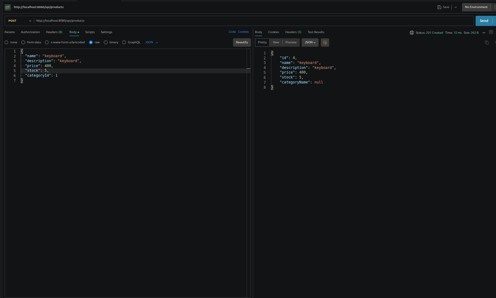
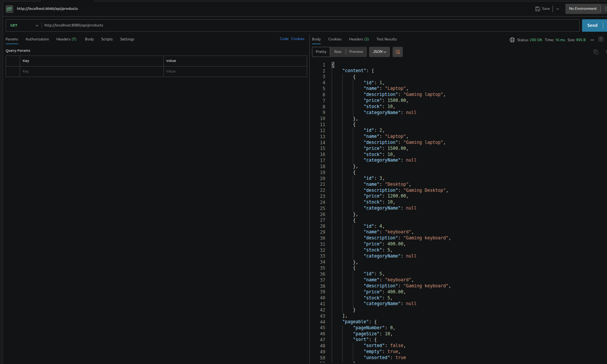
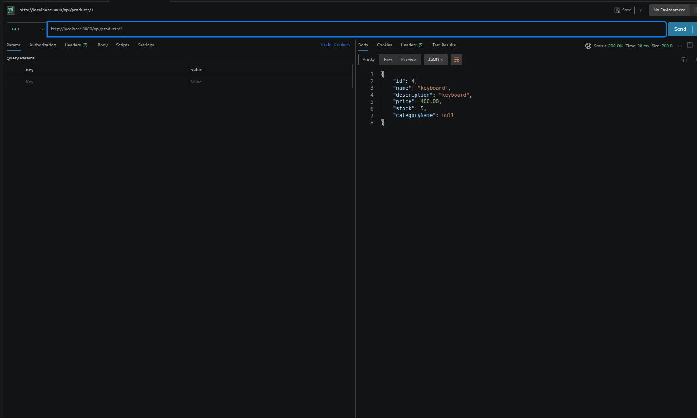
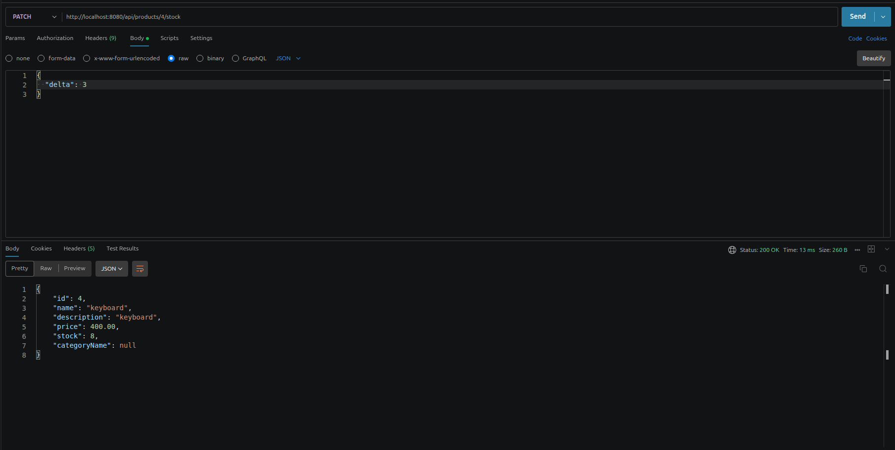
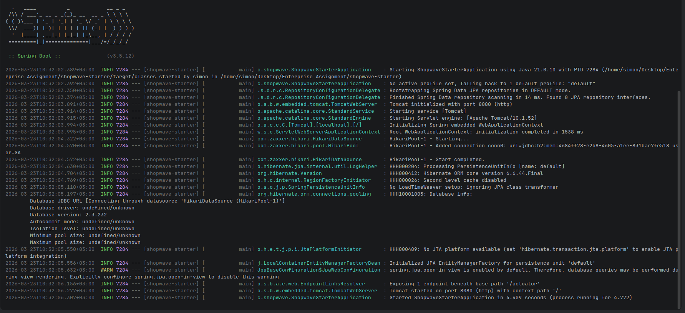
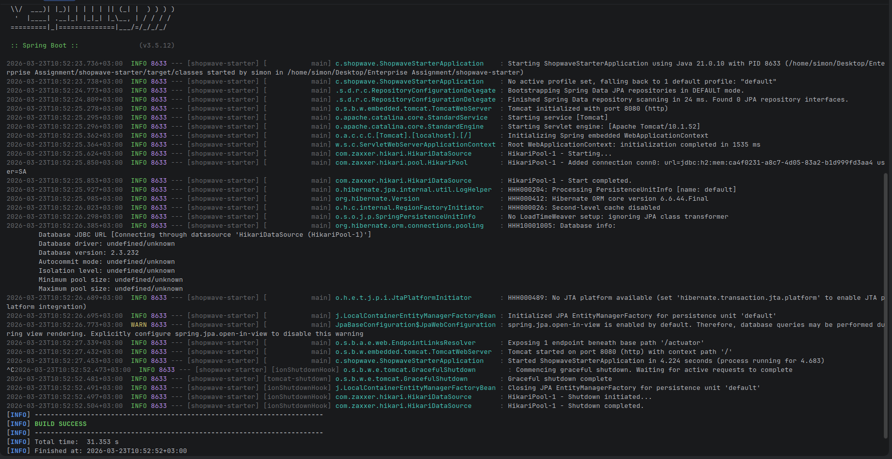
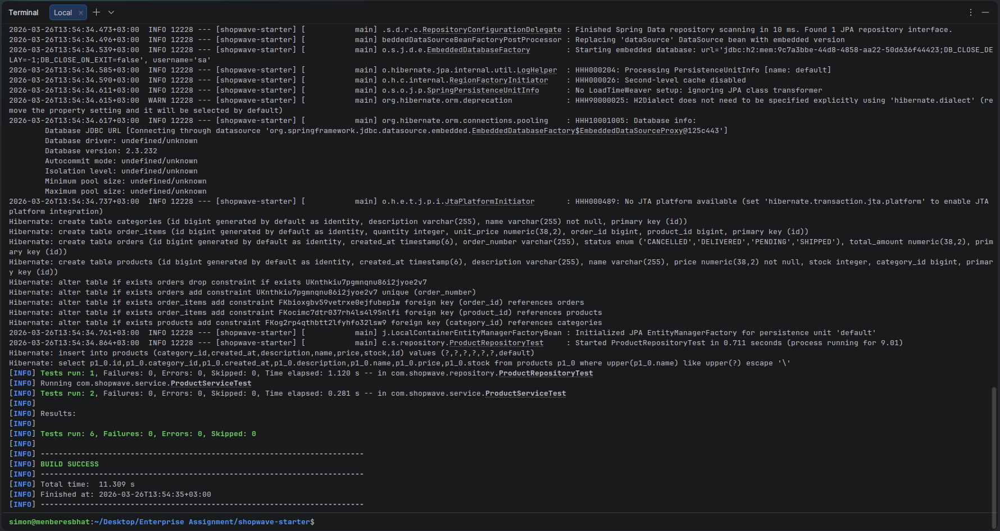
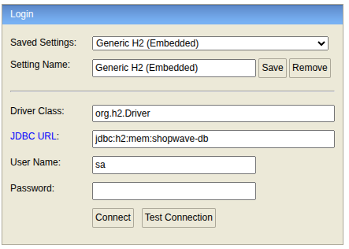
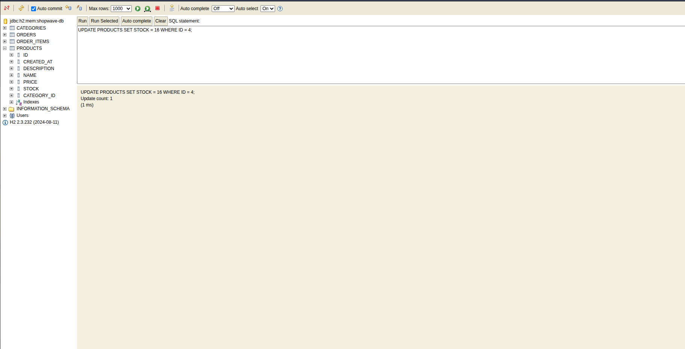

# 🛍️ ShopWave - Enterprise Application Development Assignment

## 📌 Overview

ShopWave is a Spring Boot-based RESTful application developed as part of the Enterprise Application Development course.
The system manages **products, categories, and orders** using a layered architecture and follows best practices in modern Java backend development.

---

## ⚙️ Technologies Used

* Java 21
* Spring Boot
* Spring Data JPA
* Hibernate
* H2 Database (In-Memory)
* Maven
* Lombok
* JUnit 5 & Mockito

---

## 📁 Project Structure

```
com.shopwave
├── controller    # REST Controllers
├── service       # Business Logic
├── repository    # Data Access Layer
├── model         # Entities
├── dto           # Data Transfer Objects
└── exception     # Custom Exceptions
```

---

## 🚀 Features Implemented

### 📦 Product Management

* Create product
  

* Get all products
  

* Get product by ID
  

* Manage product stock
  
  

---

### 🌐 REST API

* Clean RESTful endpoint design
* Proper HTTP status codes (201, 200, 404, etc.)

---

### 🧪 Testing

* Unit Testing with Mockito
* Controller Testing (`@WebMvcTest`)
* Repository Testing (`@DataJpaTest`)

---

## 📡 API Endpoints

### 📦 Product Endpoints

| Method | Endpoint                   | Description          |
| ------ | -------------------------- | -------------------- |
| POST   | `/api/products`            | Create product       |
| GET    | `/api/products`            | Get all products     |
| GET    | `/api/products/{id}`       | Get product by ID    |
| PATCH  | `/api/products/{id}/stock` | Update product stock |

---

## 📥 Sample Request

### Create Product

```json
POST /api/products
Content-Type: application/json

{
  "name": "Laptop",
  "description": "Gaming laptop",
  "price": 1500,
  "stock": 10,
  "categoryId": 1
}
```

---

## 📤 Sample Response

```json
{
  "id": 1,
  "name": "Laptop",
  "description": "Gaming laptop",
  "price": 1500,
  "stock": 10,
  "categoryName": null
}
```

---

## ▶️ Running the Application

```bash
mvn spring-boot:run
```

Expected result:

```
BUILD SUCCESS
```




---

## 🧪 Running Tests

```bash
mvn test
```

Expected result:

```
BUILD SUCCESS
```



---

## 🗄️ H2 Database Console

Access the H2 console at:

```
http://localhost:8080/h2-console
```




### Configuration

* JDBC URL: `jdbc:h2:mem:shopwave-db`
* Username: `sa`
* Password: *(leave empty)*

---

## 👤 Author

**Name:** Simon Mesfin
**ID:** ATE/7211/14

---

## 🙌 Acknowledgements

* ChatGPT – Technical guidance & documentation support
* GeeksforGeeks – Concept explanations

---
